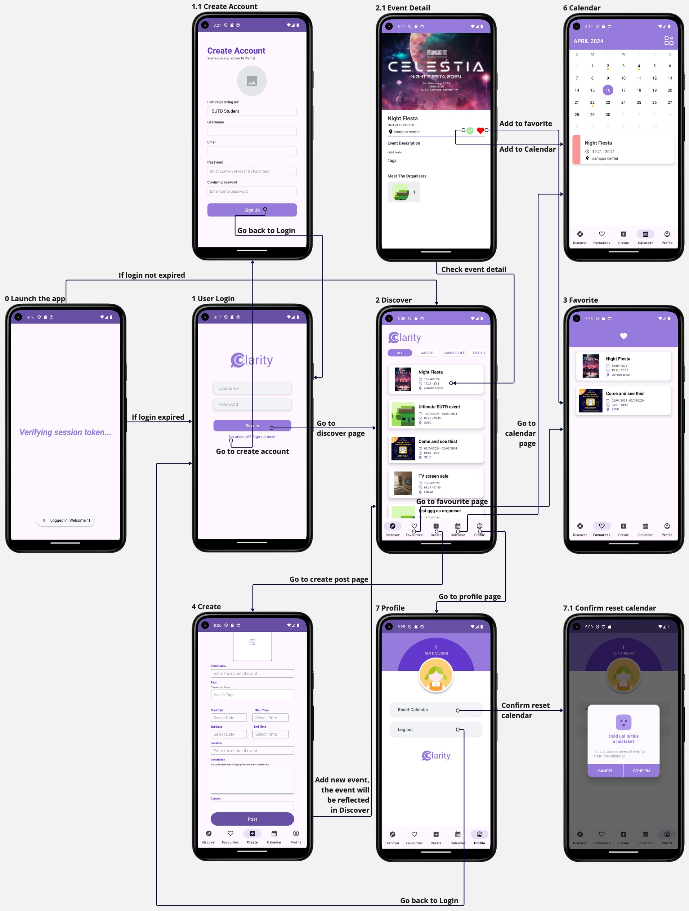
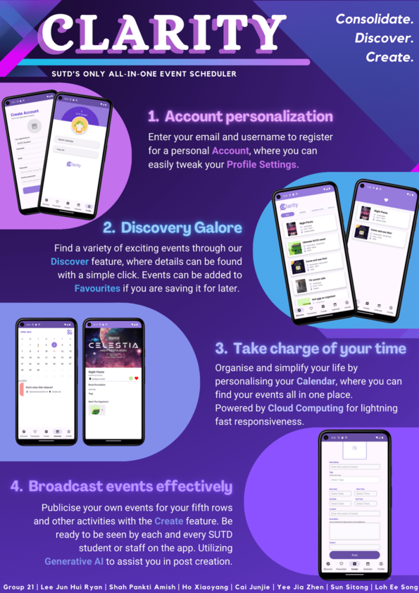

# Clarity 

## Project Description 
Clarity is an event scheduler app. It aims to provide a better user experience for the SUTD community when browsing for ongoing events with the functionality to add them to the in-built personalised calendar. We have four main functionalities, namely the account personalisation, the discovery page, the addition of events to the calendar, and the creation of user-sourced events. 
1. Account personalisation: users enter their email and username to register for a personal account, where they can easily tweak profile settings
2. Discovery page: a variety of exciting events can be found and filtered through tags. Events can be added to “Favourites” if users are still deliberating whether or not to add it to their calendar. 
3. Personalised calendar: users can organise and centralise their schedule with their personalised calendar, where they can find their events all in one place. 
4. User created events: allows all users to publicise their own events with the Create feature.

## Video Demo 
See this [link](https://youtu.be/nA8UiuVoI08) 

## Visuals 

This flowchart shows all the screens and associated user interactions. 

### Poster

## Technologies Used 
For the app:
- JDK: `jbr-17`
- Android SDK: `Android 14 UpsideDownCake API Level 34` 

For AWS RDS backend: 
- Python 

To use the app, download this repo and compile with Android Studio according to the specs above to see the UI. The development of this app is done using the Pixel 5a AVD within Android Studio and a physical phone Samsung Flip 5. 

Do note that the database is closed, so remove any database calls or the app may crash. 

## Acknowledgement 
This project would not be possible without  Pankti Shah, Yee Jia Zhen, Sun Sitong, Ho Xiaoyang, Cai Junjie, Ryan Lee. Thanks for the great work!  
